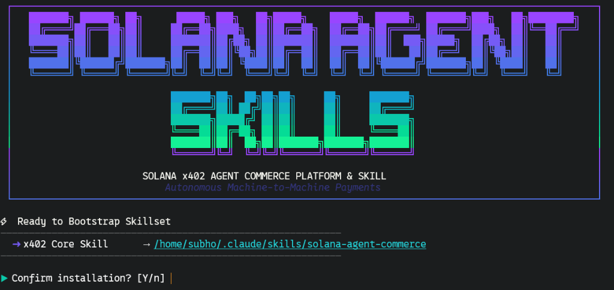

# Solana Agent Commerce Skill (x402)

[](https://x402.org)
[](https://solana.com)
[](https://circle.com/usdc)
[](LICENSE)

The **Solana Agent Commerce Skill** is a production-grade developer integration toolkit for building Solana x402 paid APIs, paid MCP gateways, and buyer agents with strict USDC spend policies.

By leveraging the HTTP `402 Payment Required` status code, the x402 protocol enables machine-to-machine (M2M) payment flows where agents can pay for resources and receive auditable payment receipts.

> [!IMPORTANT]
> This skill strictly adheres to the v2 x402 specification utilizing the modern `@solana/kit` (v2) library for all transaction and cryptographic signing routines.

---

## 🌟 Key Features

*   **Standard HTTP 402 Workflows**: Automatic generation and resolution of payment challenges via Hono, Express, Fastify, and Next.js.
*   **Solana x402 Defaults**: Native support for x402 v2, `exact` SVM scheme, CAIP-2 network IDs, and SPL USDC mint verification.
*   **Autonomous Buyer Safety**: Pre-execution domain allowlists, payee allowlists, atomic-unit spend caps, receipt logs, and idempotency.
*   **Agent Framework Integration**: Deep compatibility with **Solana Agent Kit**, **LangChain**, and **Vercel AI SDK**, including multi-agent architectures where agents pay each other for specialized microservices.
*   **MCP Server Monetization**: Wrap any standard Model Context Protocol (MCP) server behind Solana micropayments using an HTTP gateway.
*   **DeFi Integration**: Hook payment challenges into Jupiter v6 SOL-to-USDC swaps for automatic agent wallet top-ups.

---

## 📁 Directory Structure

```text
├── README.md                          # Project overview and specifications
├── LICENSE                            # MIT License
├── install.sh                         # Developer installation script
├── install-custom.sh                  # Custom installer for agents and rules
├── skill/
│   ├── SKILL.md                       # Routing entry point & progressive load hub
│   └── references/
│       ├── x402-server-patterns.md    # Express, Hono, and Next.js middleware setups
│       ├── x402-client-patterns.md    # Fetch wrappers, wallet configs, and spending caps
│       ├── x402-solana-integration.md # CAIP-2 IDs, USDC mints, ATA, Token-2022, nonces, compute budget
│       ├── x402-facilitator.md        # Verifier/facilitator configurations (hosted/self-hosted)
│       ├── x402-agent-kit.md          # AI SDK, LangGraph, and Solana Agent Kit patterns
│       ├── x402-mcp-monetization.md   # Wrapping and monetizing MCP servers (batch/stream)
│       ├── x402-security.md           # Key management, spending caps, OFAC, gas limits, LLM inject defenses
│       ├── x402-testing.md            # Devnet, Vitest suite, CI configuration, k6 load tests
│       ├── x402-defi-jupiter.md       # SOL-to-USDC auto-swap quote & swap execute top-ups
│       ├── x402-defi-protocols.md     # Monetizing Orca Whirlpools, Raydium, Meteora, and Drift data APIs
│       ├── x402-data-infrastructure.md# Paid Helius DAS & fee proxies, Pyth oracle payloads, wrangler Workers
│       └── x402-multi-agent.md        # Registry specifications, delegation, multi-hop cost traces
├── agents/
│   ├── x402-architect.md              # System design & architecture helper agent
│   ├── x402-builder.md                # Node.js/TypeScript developer helper agent
│   └── x402-auditor.md                # Security review helper agent
├── commands/
│   ├── audit-routes.md                # Audit routes for x402 compliance
│   ├── scaffold-buyer.md              # Scaffold a buyer agent
│   ├── scaffold-seller.md             # Scaffold a seller service
│   ├── test-devnet.md                 # Test workflows on devnet
│   ├── x402-scaffold.md               # Base scaffolding helper script
│   ├── scaffold-mcp.md                # Scaffold pay-per-call MCP tool server
│   ├── request-faucet.md              # Bootstrapping SOL + devnet USDC
│   └── verify-payment.md              # Verify transaction signature on-chain
└── rules/
    └── x402-security-rules.md         # Custom guidelines for safe agent commerce
```

---

## 🚀 Quick Start & Installation

To install this skill into Codex, clone the repository and run the install script:

```bash
git clone https://github.com/solanabr/solana-agent-commerce-skill
cd solana-agent-commerce-skill
./install.sh --agents --rules --commands
```

### Installation Preview



### Installation Flags

*   `--agents`: Installs the `x402-architect`, `x402-builder`, and `x402-auditor` system agents to `.agents/`.
*   `--rules`: Copies the custom developer safety guidelines (`x402-security-rules.md`) to the target configuration.
*   `--commands`: Installs the custom command prompts.
*   `--target claude`: Installs to Claude-style paths instead of Codex paths.

---

## 🔌 Integration Overview & Techniques

Below are the key integration techniques used to deploy secure, autonomous Solana agent commerce.

### 1. Guarding an API (Server Side - Hono)

Leverage Hono edge-first middleware to declare price, network, payee, and asset requirements:

```typescript
import { Hono } from "hono";
import { paymentMiddleware } from "@x402/hono";
import { ExactSvmScheme } from "@x402/svm";

const app = new Hono();

app.use(
  "/api/v1/summarize",
  paymentMiddleware({
    "POST /api/v1/summarize": {
      accepts: [{
        scheme: ExactSvmScheme.scheme,
        network: "solana:EtWTRABZaYq6iMfeYKouRu166VU2xqa1", // Devnet CAIP-2
        maxAmountRequired: "50000", // 0.05 USDC (6 decimals)
        payTo: process.env.PAYEE_WALLET!,
        asset: "4zMMC9srt5Ri5X14GAgXhaHii3GnPAEERYPJgZJDncDU",
        maxAgeSeconds: 60,
      }],
      description: "Summarize premium articles.",
    },
  })
);

app.post("/api/v1/summarize", (c) => {
  if (!c.req.header("Idempotency-Key")) {
    return c.json({ error: "Idempotency-Key required" }, 428);
  }
  return c.json({ summary: "Summary output..." });
});
```

### 2. Auto-Topup swap via Jupiter (Pattern B Client)

Integrate client-side top-up flows to swap SOL to USDC on the fly if the agent's USDC balance is insufficient for a payment challenge:

```typescript
import { wrapFetchWithPayment } from "@x402/fetch";
import { getJupiterQuote, executeJupiterSwap } from "./jupiter-swap";
import { getAssociatedTokenAddress } from "@solana/spl-token";
import { createSolanaRpc, PublicKey } from "@solana/kit";

async function assertAndTopUpSpend(
  rpcUrl: string,
  requestedAtomicUsdc: bigint,
  signer: any
) {
  const rpc = createSolanaRpc(rpcUrl);
  const usdcAta = await getAssociatedTokenAddress(
    new PublicKey("EPjFWdd5AufqSSqeM2qN1xzybapC8G4wEGGkZwyTDt1v"),
    new PublicKey(signer.address)
  );

  let currentBalance = 0n;
  try {
    const res = await rpc.getTokenAccountBalance(usdcAta.toBase58()).send();
    currentBalance = BigInt(res.value.amount);
  } catch (err) {}

  if (currentBalance < requestedAtomicUsdc) {
    const deficit = requestedAtomicUsdc - currentBalance;
    const quote = await getJupiterQuote(deficit * 1000n); // SOL estimate
    await executeJupiterSwap(quote, signer, rpcUrl);
  }
}
```

### 3. Monetizing MCP Tool Calls

Monetize Model Context Protocol (MCP) servers using an HTTP proxy that checks tool pricing and registers them in the `tools/list` schema:

```typescript
// Gating tool calls using the x402 fetch pipeline
app.post("/mcp/v1/tools/call", async (c) => {
  const body = await c.req.json();
  const price = priceByTool[body.name]; // e.g. "10000" (0.01 USDC)
  
  // Verify transaction payload...
  // Connect downstream and execute tool call:
  const result = await mcpClient.callTool({
    name: body.name,
    arguments: body.arguments,
  });

  return c.json(result);
});
```

### 4. Multi-Hop Cost Accounting

In complex multi-agent setups (Orchestrator -> Researcher -> Translator), pass trace headers to account for spending across the pipeline:

```typescript
interface BudgetTrace {
  sessionId: string;
  originalBudgetAtomic: string;
  remainingBudgetAtomic: string;
  hopCount: number;
}

// Injected into outgoing paid fetch headers to prevent cascading runaway spend
headers.set("X-Session-Budget-Trace", JSON.stringify(budgetTrace));
```

---

## 🎨 System Architecture

```text
┌─────────────────────────────────────────────────────────────┐
│  Orchestrator Agent (Buyer)        Worker Agent (Seller)    │
│  ┌───────────────────────┐         ┌──────────────────────┐ │
│  │ Solana Agent Kit      │         │ Hono / Express       │ │
│  │ ├─ Jupiter Auto-Swap  │ ──402─► │ ├─ x402 Middleware   │ │
│  │ ├─ @x402/fetch wrapper│ ◄──TXN─ │ ├─ Pyth / Helius     │ │
│  │ └─ Spend Limits       │ ──200─► │ └─ Specialized Task  │ │
│  └───────────────────────┘         └──────────────────────┘ │
│              │                               │              │
│              └─────► Solana Mainnet ◄────────┘              │
└─────────────────────────────────────────────────────────────┘
```

For a detailed visual walkthrough of the build-time developer agent flow and runtime agent-to-agent transactions, see the [Agent Workflows & Flowcharts](file:///c:/Users/subho/OneDrive/Documents/solanaagentskill/docs/agent_workflow.md) guide.

---

## ⚖️ License

This project is licensed under the MIT License - see the [LICENSE](LICENSE) file for details.
