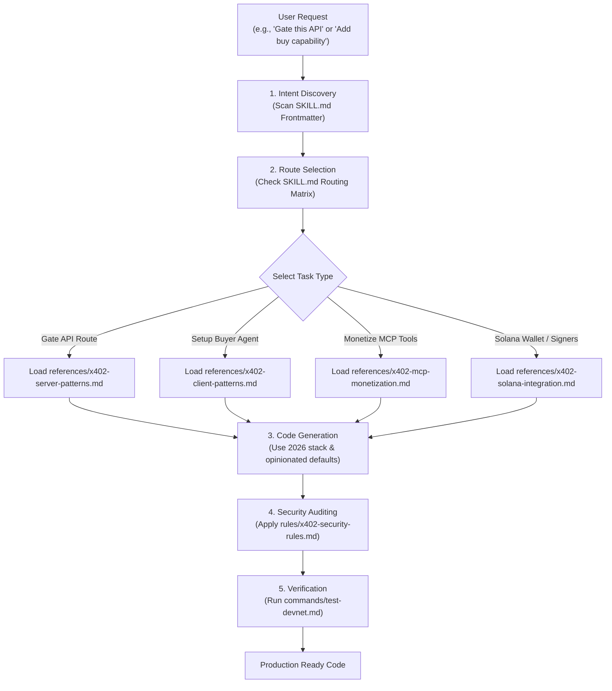
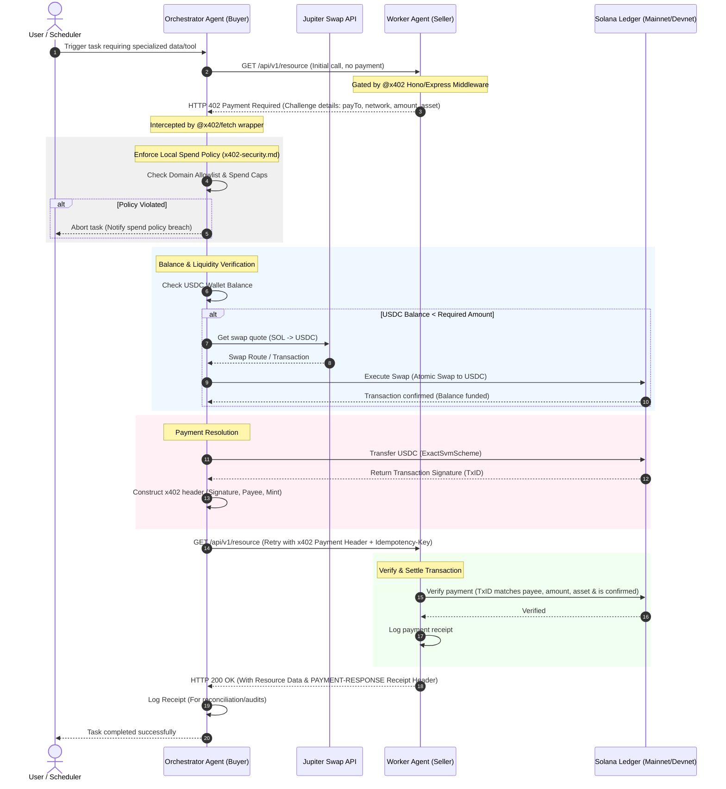

# Agent Commerce & Build Workflows

This document outlines the workflows and flowcharts illustrating how developer agents utilize the **Solana Agent Commerce Skill** to build paid integrations, and how autonomous runtime agents utilize the resulting protocol to transact safely on Solana.

---

## 1. Build-Time: AI Developer Agent Workflow

This flowchart illustrates how an AI agent (e.g., your coding assistant, `x402-builder`, or `x402-architect`) utilizes this skill's progressive loading architecture to build and audit new features.

---

## 2. Runtime: Autonomous Agent-to-Agent Commerce Workflow

This flowchart illustrates the step-by-step runtime interaction of an autonomous **Orchestrator Agent (Buyer)** calling a **Worker Agent (Seller)** gated by the x402 protocol, incorporating local safety checks and liquidity swaps.

---

## 3. Best Practices for Implementing Workflows

When implementing these workflows in your application:

1. **Keep Signers Safe**: Never expose private keys directly to LLMs. Use `@x402/fetch` which encapsulates private key signing inside a closed JS closure.
2. **Enforce Daily Budgets**: Implement hard limits in your agent code to prevent "runaway agent loops" from draining the wallet.
3. **Idempotency is Mandatory**: Always supply unique UUIDs in the `Idempotency-Key` headers on client calls and verify them on the server to prevent double-charging on network retries.
4. **Devnet First**: Always test with the public facilitator on Devnet using `solana:EtWTRABZaYq6iMfeYKouRu166VU2xqa1` and Devnet USDC before deploying to Mainnet.
