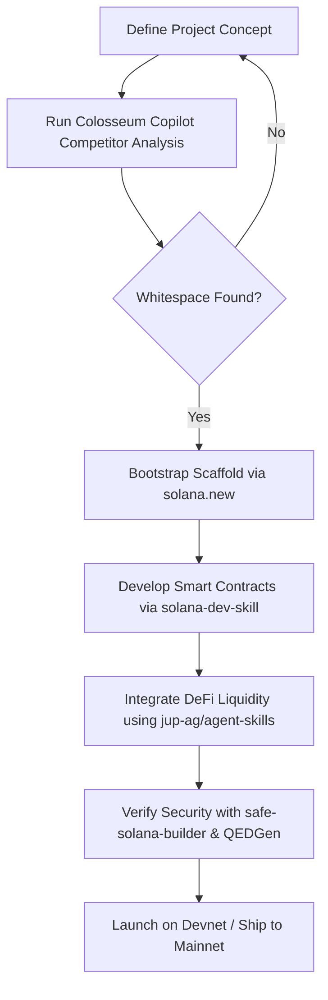

# Startup & Go-To-Market (GTM) Skills

This guide details the integration patterns for GTM research and rapid project bootstrapping using **`ColosseumOrg/colosseum-copilot`** and **`sendaifun/solana-new`**.

---

## 1. Colosseum Hackathon Database (`ColosseumOrg/colosseum-copilot`)

The **Colosseum Copilot** skill provides access to historical Solana hackathon data, tech stacks, cypherpunk literature, and competitive maps to help teams perform whitespace analysis.

### Authenticating and Querying the Copilot API
To interact with the Copilot, you must obtain a Personal Access Token (PAT) from `arena.colosseum.org/copilot`.

#### Step 1: Export Environment Variables
```bash
export COLOSSEUM_COPILOT_PAT="your_personal_access_token_here"
export COLOSSEUM_COPILOT_API_BASE="https://copilot.colosseum.com/api/v1"
```

#### Step 2: Fetch Competitor Analysis via Python Script
Below is a Python utility to search the Colosseum database for similar project submissions.

```python
import os
import requests

def analyze_competitors(project_description: str):
    api_base = os.getenv("COLOSSEUM_COPILOT_API_BASE", "https://copilot.colosseum.com/api/v1")
    pat = os.getenv("COLOSSEUM_COPILOT_PAT")

    if not pat:
        raise ValueError("COLOSSEUM_COPILOT_PAT environment variable not set")

    headers = {
        "Authorization": f"Bearer {pat}",
        "Content-Type": "application/json"
    }

    payload = {
        "query": project_description,
        "limit": 5,
        "search_type": "semantic" # Performs semantic vector search on hackathon projects
    }

    url = f"{api_base}/projects/search"
    response = requests.post(url, json=payload, headers=headers)
    
    if response.status_code != 200:
        raise Exception(f"API Request failed with status {response.status_code}: {response.text}")

    results = response.json()
    
    print("--- Similar Projects Found in Colosseum Archives ---")
    for project in results.get("projects", []):
        print(f"\nProject Name: {project.get('name')}")
        print(f"Track: {project.get('track')}")
        print(f"Hackathon: {project.get('hackathon_season')}")
        print(f"Summary: {project.get('summary')}")
        print(f"Tech Stack: {', '.join(project.get('tech_stack', []))}")
        print("-" * 50)

if __name__ == "__main__":
    # Example whitespace query
    query = "A decentralized machine-to-machine payment protocol using HTTP 402 for agent wallets on Solana"
    analyze_competitors(query)
```

---

## 2. Bootstrapping with `solana.new` (`sendaifun/solana-new`)

The **`solana.new`** project provides automated setups for initializing modern, clean Solana templates equipped with agent-friendly configs, MCP servers, and deployment pipelines.

### Setup and Bootstrapping

To create a new project with all necessary agent capabilities preconfigured, run:

```bash
curl -fsSL https://www.solana.new/setup.sh | bash
```

This sets up:
*   An Anchor program project inside `./program`.
*   A Next.js frontend with Helius RPC configuration.
*   A Model Context Protocol (MCP) server ready for agent interaction.

---

## 3. Recommended Startup/GTM Workflow

For developers building a new protocol on Solana, combining these tools provides an efficient pipeline:


